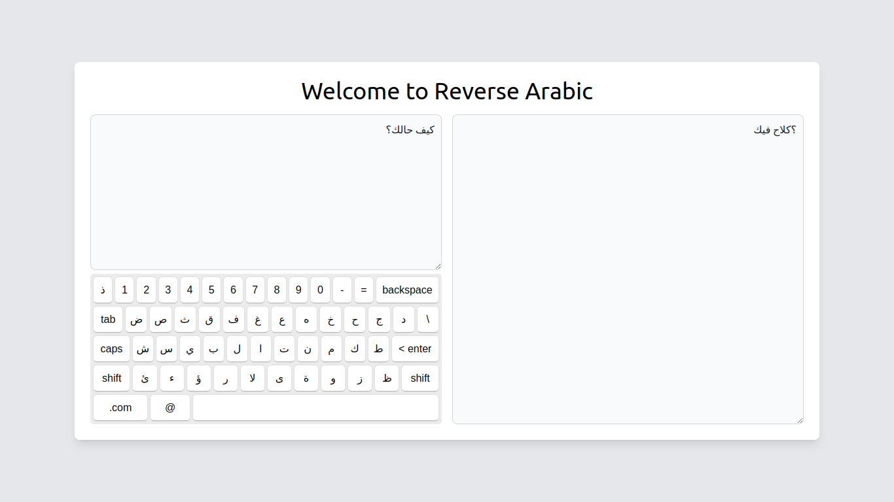

# Reverse Arabic

Reverse Arabic is a free Converter arabic text to a format compatible with designing software.

# Screenshot



## Getting Started

1. run the development server:

```bash
npm install
npm run dev
```

2. Open [http://localhost:5173](http://localhost:5173/) with your browser.
